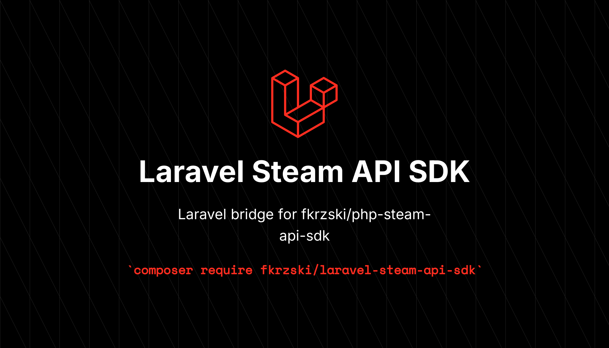

# Laravel Steam API SDK



[](https://packagist.org/packages/fkrzski/laravel-steam-api-sdk)
[](https://packagist.org/packages/fkrzski/laravel-steam-api-sdk)
[](https://packagist.org/packages/fkrzski/laravel-steam-api-sdk)
[](https://github.com/fkrzski/laravel-steam-api-sdk/actions/workflows/tests.yml)

Laravel bridge for [`fkrzski/php-steam-api-sdk`](https://github.com/fkrzski/php-steam-api-sdk). Ships a service provider, a `Steam` facade and a `Steam::fake()` test helper so you can talk to the [Steam Web API](https://steamcommunity.com/dev) the Laravel way.

- Auto-discovered `SteamConnector` singleton, Octane-safe.
- Rate-limit budget shared across processes through the Laravel cache store.
- Fluent `Steam` facade with first-class request helpers.
- One-liner test fakes via Saloon's `MockClient`.

## Requirements

- PHP **8.5+**
- Laravel **13+**

## Installation

```bash
composer require fkrzski/laravel-steam-api-sdk
```

The service provider and `Steam` facade are auto-discovered. Publish the config to override defaults:

```bash
php artisan vendor:publish --tag=steam-api-config
```

Set your Steam Web API key in `.env`:

```dotenv
STEAM_API_KEY=your-steam-web-api-key
```

## Usage

```php
use Fkrzski\LaravelSteamApiSdk\Facades\Steam;
use Fkrzski\SteamApiSdk\ValueObjects\SteamId;

$id = SteamId::fromSteamId64('76561198000000000');

$summaries    = Steam::playerSummaries([$id]);
$library      = Steam::ownedGames($id, appIdsFilter: [381210]);
$stats        = Steam::userStatsForGame($id, appId: 381210);
$achievements = Steam::playerAchievements($id, appId: 381210);
$resolvedId   = Steam::resolveVanityUrl('gabelogannewell');
```

DTOs, the `SteamId` value object and the exception hierarchy all come from the underlying SDK — see its [README](https://github.com/fkrzski/php-steam-api-sdk) for the full surface.

### Concurrent requests

Use `pool()` to fan out several requests at once:

```php
use Fkrzski\LaravelSteamApiSdk\Facades\Steam;
use Fkrzski\SteamApiSdk\Http\Requests\GetOwnedGamesRequest;
use Fkrzski\SteamApiSdk\Http\Requests\GetPlayerSummariesRequest;
use Saloon\Http\Response;

Steam::pool(
    requests: [
        new GetOwnedGamesRequest($id, [381210]),
        new GetPlayerSummariesRequest([$id]),
    ],
    concurrency: 2,
    responseHandler: fn (Response $response) => /* ... */,
)->send()->wait();
```

### Escape hatch

Need the raw connector or a custom request? Reach for it directly:

```php
Steam::connector();          // the underlying SteamConnector
Steam::send($customRequest); // any Saloon Request
```

## Testing

`Steam::fake()` attaches a Saloon `MockClient` to the singleton connector and returns it for assertions:

```php
use Fkrzski\LaravelSteamApiSdk\Facades\Steam;
use Fkrzski\SteamApiSdk\Http\Requests\GetPlayerSummariesRequest;
use Saloon\Http\Faking\MockResponse;

$mock = Steam::fake([
    GetPlayerSummariesRequest::class => MockResponse::make([
        'response' => ['players' => [/* ... */]],
    ]),
]);

// ... exercise code that calls the Steam API ...

$mock->assertSent(GetPlayerSummariesRequest::class);
```

## License

MIT. See [LICENSE.md](LICENSE.md).
