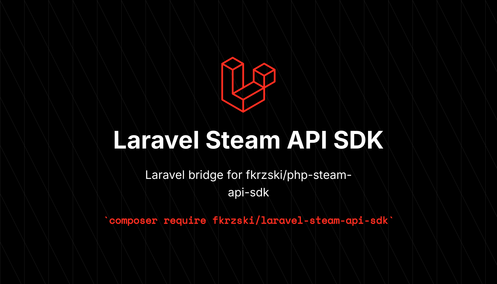

# Laravel Steam API SDK



[](https://packagist.org/packages/fkrzski/laravel-steam-api-sdk)
[](https://packagist.org/packages/fkrzski/laravel-steam-api-sdk)
[](https://packagist.org/packages/fkrzski/laravel-steam-api-sdk)
[](https://github.com/fkrzski/laravel-steam-api-sdk/actions/workflows/tests.yml)

Laravel bridge for [`fkrzski/php-steam-api-sdk`](https://github.com/fkrzski/php-steam-api-sdk). Ships a service provider, a `Steam` facade and a `Steam::fake()` test helper so you can talk to the [Steam Web API](https://steamcommunity.com/dev) the Laravel way.

- Auto-discovered `SteamConnector` binding, scoped per request and safe under Octane.
- Rate-limit budget shared across processes through the Laravel cache store.
- Fluent `Steam` facade with first-class request helpers.
- `AsSteamId` Eloquent cast, `SteamIdRule` validation rule and one-liner test fakes via Saloon's `MockClient`.

## Requirements

- PHP **8.5+**
- Laravel **13+**

## Installation

```bash
composer require fkrzski/laravel-steam-api-sdk
```

The service provider and `Steam` facade are auto-discovered. Run the installer to publish the config and store your key:

```bash
php artisan steam:install
```

It writes `config/steam-api.php` and asks for your [Steam Web API key](https://steamcommunity.com/dev), appending it to `.env`. Both steps are also fine to do by hand:

```bash
php artisan vendor:publish --tag=steam-api-config
```

```dotenv
STEAM_API_KEY=your-steam-web-api-key
```

## Quick start

```php
use Fkrzski\LaravelSteamApiSdk\Facades\Steam;
use Fkrzski\SteamApiSdk\ValueObjects\SteamId;

$id = SteamId::fromSteamId64('76561198000000000');

$summaries    = Steam::playerSummaries([$id]);
$bans         = Steam::playerBans([$id]);
$friends      = Steam::friendList($id);
$groups       = Steam::userGroupList($id);
$library      = Steam::ownedGames($id, appIdsFilter: [381210]);
$stats        = Steam::userStatsForGame($id, appId: 381210);
$achievements = Steam::playerAchievements($id, appId: 381210);
$resolvedId   = Steam::resolveVanityUrl('gabelogannewell');
```

Each helper returns a strongly-typed DTO from the underlying SDK — you never touch raw JSON.

## Documentation

Full documentation lives at **[docs.fkrzski.dev/laravel-steam-api-sdk](https://docs.fkrzski.dev/laravel-steam-api-sdk)**:

- [Guide](https://docs.fkrzski.dev/laravel-steam-api-sdk/guide) — the `SteamId` value object, facade helpers, exceptions, and concurrent requests.
- [Configuration](https://docs.fkrzski.dev/laravel-steam-api-sdk/configuration) — the config file, your API key, and the cache-backed rate limit.
- [API reference](https://docs.fkrzski.dev/laravel-steam-api-sdk/api-reference) — every facade method, its parameters, return type, and errors.
- [Eloquent cast](https://docs.fkrzski.dev/laravel-steam-api-sdk/eloquent-cast) — persist a Steam ID on a model with `AsSteamId`.
- [Route binding](https://docs.fkrzski.dev/laravel-steam-api-sdk/route-binding) — opt in to resolving a `{steamId}` route parameter into a `SteamId` value object.
- [Validation rule](https://docs.fkrzski.dev/laravel-steam-api-sdk/validation) — validate submitted Steam IDs with `SteamIdRule`.
- [Testing](https://docs.fkrzski.dev/laravel-steam-api-sdk/testing) — fake the Steam Web API with `Steam::fake()`.

## License

MIT. See [LICENSE.md](LICENSE.md).
