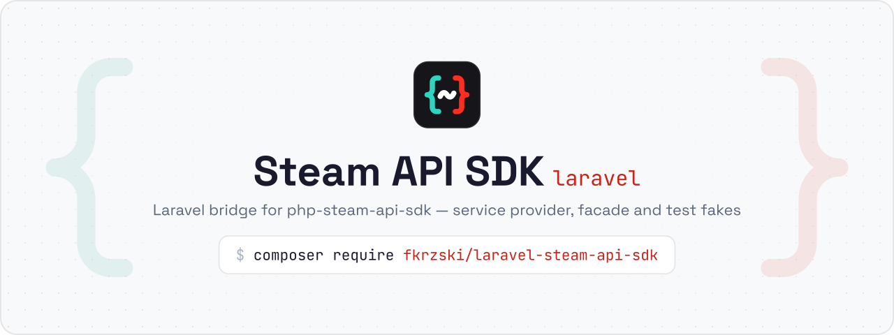

# Laravel Steam API SDK

<picture>
  <source media="(prefers-color-scheme: dark)" srcset="art/banner-dark.svg">
  
</picture>

[](https://packagist.org/packages/fkrzski/laravel-steam-api-sdk)
[](https://packagist.org/packages/fkrzski/laravel-steam-api-sdk)
[](https://packagist.org/packages/fkrzski/laravel-steam-api-sdk)
[](https://github.com/fkrzski/laravel-steam-api-sdk/actions/workflows/tests.yml)

Laravel bridge for [`fkrzski/php-steam-api-sdk`](https://github.com/fkrzski/php-steam-api-sdk). Ships a service provider, a `Steam` facade and a `Steam::fake()` test helper so you can talk to the [Steam Web API](https://steamcommunity.com/dev) the Laravel way.

It powers the [player stats](https://deadbystats.eu) on
[Dead by Stats](https://deadbystats.eu).

- Auto-discovered `SteamConnector` binding, scoped per request and safe under Octane.
- Rate-limit budget shared across processes through a Laravel cache store of your choosing.
- Timeouts and retries from the config file, and queue middleware that holds a job back once the daily budget is spent.
- Fluent `Steam` facade with first-class request helpers, a lazy news feed among them.
- Laravel events for every Steam request, response and failure, and a log channel built on them.
- Localised payloads follow your application locale, or the language you pin in config.
- `AsSteamId` Eloquent cast, `SteamIdRule` validation rule and one-liner test fakes that mirror the resources — `Steam::fake()->users()->summaries(...)` — with DTO factories for the payloads.

## Requirements

- PHP **8.5+**
- Laravel **13+**

## Installation

```bash
composer require fkrzski/laravel-steam-api-sdk
```

The service provider and `Steam` facade are auto-discovered. Run the installer to publish the config and store your key:

```bash
php artisan steam:install
```

It writes `config/steam-api.php` and asks for your [Steam Web API key](https://steamcommunity.com/dev), appending it to `.env`. Both steps are also fine to do by hand:

```bash
php artisan vendor:publish --tag=steam-api-config
```

```dotenv
STEAM_API_KEY=your-steam-web-api-key
```

## Quick start

```php
use Fkrzski\LaravelSteamApiSdk\Facades\Steam;
use Fkrzski\SteamApiSdk\ValueObjects\SteamId;

$id = SteamId::fromSteamId64('76561198000000000');

$summaries    = Steam::summaries([$id]);
$bans         = Steam::bans([$id]);
$friends      = Steam::friends($id);
$groups       = Steam::groups($id);
$library      = Steam::ownedGames($id, appIdsFilter: [381210]);
$recentGames  = Steam::recentlyPlayedGames($id);
$level        = Steam::steamLevel($id);
$badges       = Steam::badges($id);
$quests       = Steam::communityBadgeProgress($id);
$stats        = Steam::userStats($id, appId: 381210);
$achievements = Steam::achievements($id, appId: 381210);
$playing      = Steam::currentPlayers(appId: 381210);
$globalStats  = Steam::globalAchievements(gameId: 381210);
$gameSchema   = Steam::schema(appId: 381210);
$resolvedId   = Steam::resolveVanityUrl('gabelogannewell');
$versionCheck = Steam::upToDateCheck(appId: 440, version: $installedVersion);
$servers      = Steam::serversAtAddress('108.181.62.21');
$relayNetwork = Steam::sdrConfig(appId: 730);
```

Each helper returns a strongly-typed DTO from the underlying SDK — you never touch raw JSON.

## Documentation

Full documentation lives at **[docs.fkrzski.dev/laravel-steam-api-sdk](https://docs.fkrzski.dev/laravel-steam-api-sdk)**:

- [Guide](https://docs.fkrzski.dev/laravel-steam-api-sdk/guide) — the `SteamId` value object, facade helpers, exceptions, and concurrent requests.
- [Configuration](https://docs.fkrzski.dev/laravel-steam-api-sdk/configuration) — the config file, your API key, timeouts and retries, the cache-backed rate limit and queued jobs.
- [API reference](https://docs.fkrzski.dev/laravel-steam-api-sdk/api-reference) — every facade method, its parameters, return type, and errors.
- [Eloquent cast](https://docs.fkrzski.dev/laravel-steam-api-sdk/eloquent-cast) — persist a Steam ID on a model with `AsSteamId`.
- [Route binding](https://docs.fkrzski.dev/laravel-steam-api-sdk/route-binding) — opt in to resolving a `{steamId}` route parameter into a `SteamId` value object.
- [Validation rule](https://docs.fkrzski.dev/laravel-steam-api-sdk/validation) — validate submitted Steam IDs with `SteamIdRule`.
- [Events](https://docs.fkrzski.dev/laravel-steam-api-sdk/events) — listen to Steam requests, responses and failures through Laravel events.
- [Logging](https://docs.fkrzski.dev/laravel-steam-api-sdk/logging) — log failed Steam calls, and every response if you ask, to a channel of yours.
- [Testing](https://docs.fkrzski.dev/laravel-steam-api-sdk/testing) — fake the Steam Web API with `Steam::fake()`.

## License

MIT. See [LICENSE.md](LICENSE.md).
